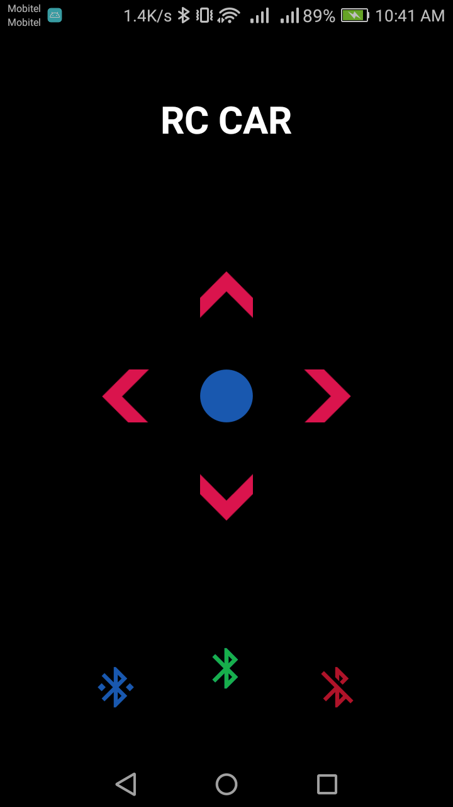

# Bluetooth RC Car Controller (Android)

This is an Android app developed to controll RC car using bluetooth. It will work above Android v5.0 (Lollipop). Forward, Reverse, Left, Right and Stop controls are available in the app.

## Getting Started

First turn on bluetooth by touching the Bluetooth icon in the center. And then Use Connect button on the left side to connect with the device.

As soon as the device is connected, app will be starting to send data to the bluetooth device.

## Setup RC Car

Use following guide lines to setup the RC Car end of the application.

* The app will be sending **n** character when no control button is pressed.
* When the Up arrow is pressed, character **u** will be sent repeatedly.
* When the Down arrow is pressed, character **d** will be sent repeatedly.
* When the Left arrow is pressed, character **l** will be sent repeatedly.
* When the Right arrow is pressed, character **r** will be sent repeatedly.
* When the Stop button which is in the middle is pressed, character **s** will be sent repeatedly.

## Authors

* **Rashintha Maduneth** - *Creating the RC Controller App*

See also the list of [contributors](https://github.com/pixy-avr/contributors) who participated in this project.

## License

This project is licensed under the MIT License - see the [LICENSE.md](LICENSE.md) file for details

## Acknowledgments

* [Bluetooth Coding Android](https://wingoodharry.wordpress.com/2014/04/15/android-sendreceive-data-with-arduino-using-bluetooth-part-2/)
* [Android Bluetooth](https://www.tutorialspoint.com/android/android_bluetooth.htm)

## Special Thanks

* [Dr. Hiran Jayaweera](http://science.cmb.ac.lk/physics/academic_staff/dr-hiran-h-e-jayaweera/)
* [Mr. Gayan Akmeemana](http://fos.cmb.ac.lk/blog/author/gayan/)
* [Mr. Deshitha Wickramarathna](http://science.cmb.ac.lk/physics/academic_staff/mr-d-d-c-wickramarathna/)
* Department of Physics at the Faculty of Science, University of Colombo, Sri Lanka.
